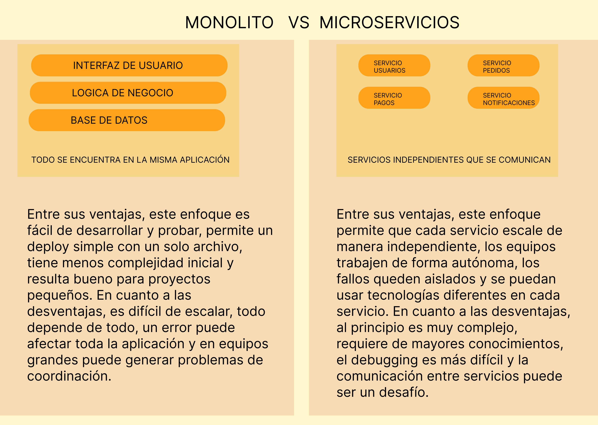
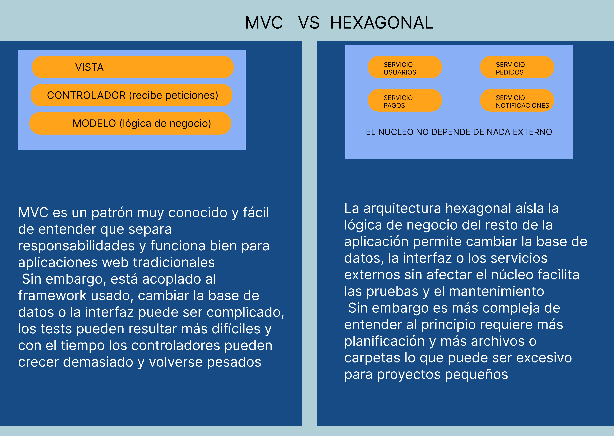

**ARQUITECTURAS Y FLUJO DE TRABAJO**
Este proyecto aplica una arquitectura monolítica organizada bajo un patrón tipo MVC y no hexagonal.
Este proyecto no sigue arquitectura hexagonal porque la lógica de negocio, la base de datos y los endpoints están todos juntos en el mismo proyecto. No hay una separación clara entre el "centro" que maneja las reglas del sistema y los adaptadores externos como la base de datos o Express. Todo está acoplado en un solo bloque de código.

**MICROSERVICIOS vs MONOLITO**
En este proyecto he utilizado una arquitectura monolítica sencilla, donde toda la aplicación reside en un solo bloque de código. Esto me permite manejar los distintos componentes sin la complejidad de separar servicios en microservicios.
En este proyecto se comparte una única instancia de Express y una única base de datos en memoria, por eso se considera monolítico :

---

app.js contiene los endpoints y la lógica de Express

user.js define el modelo de usuario con Mongoose

app.test.js contiene los tests de integración y funcionales.

Si este proyecto estuviera diseñado como microservicios, la funcionalidad se dividiría en servicios independientes aunque fueran pocos. Por ejemplo, podríamos tener un servicio dedicado a los usuarios y otro servicio para cualquier otra funcionalidad que se añadiera en el futuro. Cada servicio tendría su propio código, tests y base de datos, de manera que los datos de cada servicio estarían completamente aislados. Los tests se organizarían por servicio, con archivos separados para pruebas de integración y funcionales ( se comprobaría cada servicio de manera independiente ).

**MVC (Modelo-Vista-Controlador) o hexagonal**
MVC es un patrón de organización de código que divide la aplicación en tres partes:
**Model (Modelo)**: en el proyecto se representan modelos de datos con Mongoose (por ejemplo, el modelo de usuario en user.js).
**View (Vista)**: en el caso de este proyecto no hay una interfaz de usuario pero los endpoints de Express actúan como la "vista" al exponer datos a través de la API.
Por ejemplo, cuando se hace una petición GET a /users, el endpoint devuelve los datos de los usuarios.
**Controller (Controlador)**:aplica la lógica de negocio y maneja las peticiones entrantes. En este proyecto, los controladores están integrados en los endpoints definidos en app.js.Por ejemplo, el endpoint POST /users actúa como controlador al recibir datos para crear un nuevo usuario y procesar esa información antes de almacenarla en la base de datos.

Por ello, este proyecto aplica una arquitectura monolítica organizada bajo un patrón tipo MVC y no hexagonal.
Este proyecto no sigue arquitectura hexagonal porque la lógica de negocio, la base de datos y los endpoints están todos juntos en el mismo proyecto. No hay una separación clara entre el “centro” que maneja las reglas del sistema y los adaptadores externos como la base de datos o Express. Todo está acoplado en un solo bloque de código.

---

Para la base de datos he optado por usar MongoDB en memoria mediante mongodb-memory-server durante los tests. Esto evita afectar a datos reales y es una opción más rápida al no requerir una conexión a una base de datos externa.

En cuanto al enfoque de los tests, se han aplicado distintos tipos de tests, incluyendo el **Test-Driven Development (TDD)**. Esto significa que primero se escriben los tests, para luego desarrollar la lógica de la aplicación que haga que los tests pasen. Esta práctica asegura que cada funcionalidad implementada cumpla con los requisitos esperados y que cualquier cambio posterior pueda verificarse rápidamente.

**Los tests de integración** se encargan de comprobar que los distintos componentes de la API funcionan correctamente juntos, simulando peticiones HTTP con Supertest y verificando el comportamiento completo desde el endpoint hasta la base de datos. Por otra parte, **los tests funcionales** validan flujos completos de trabajo, garantizando que las interacciones del usuario se manejen correctamente.
